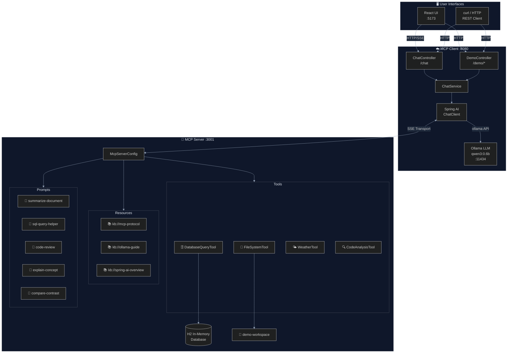
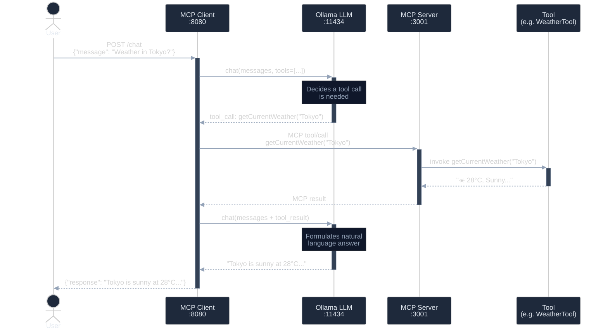
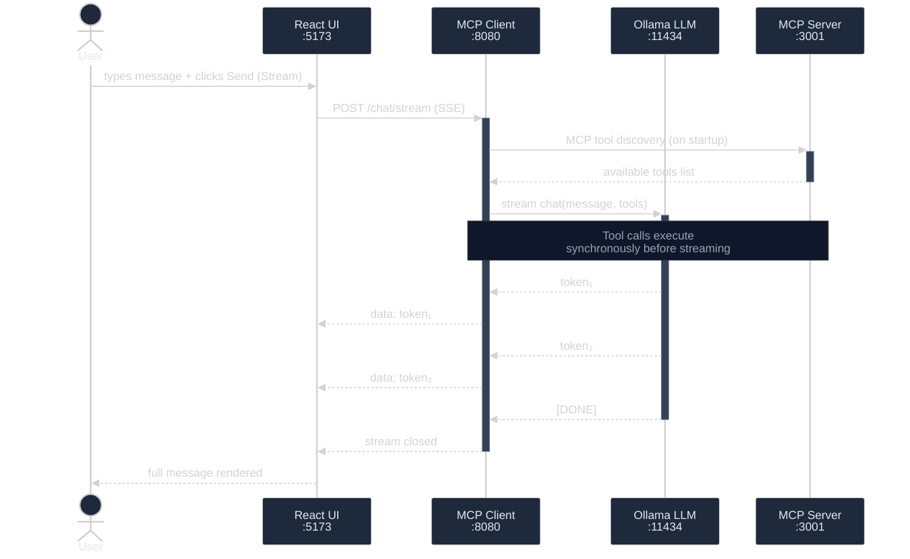
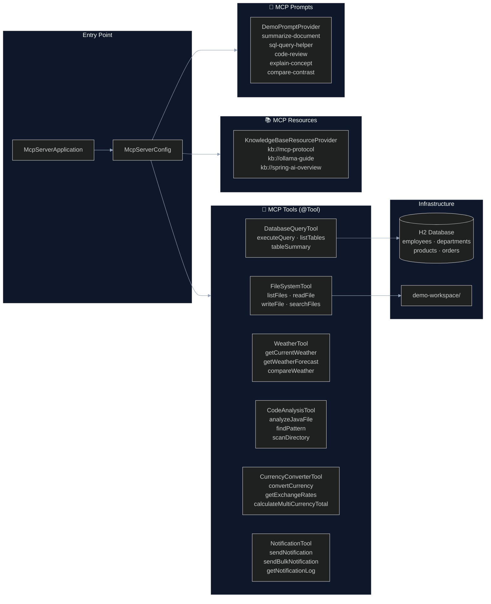
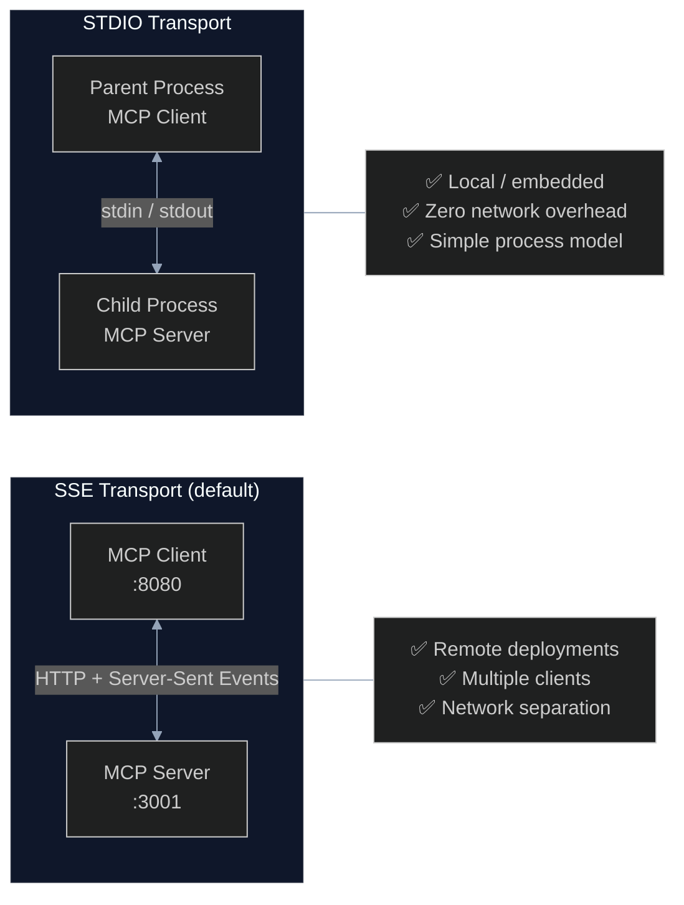
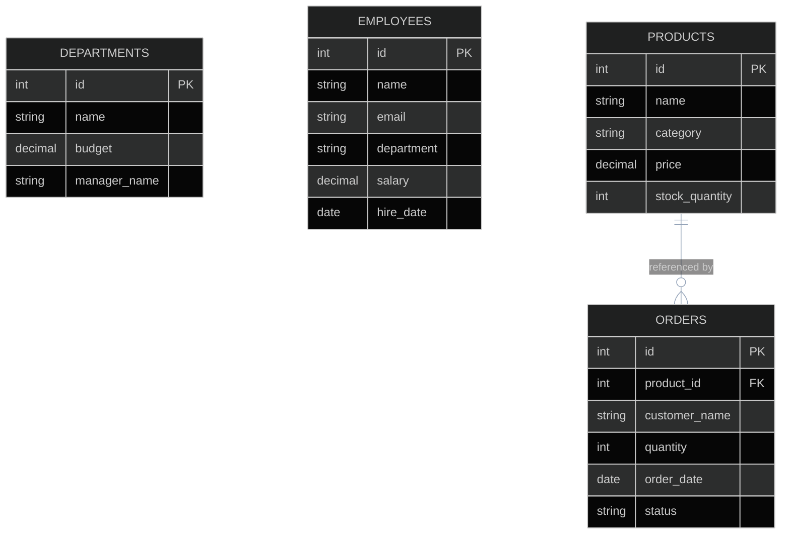
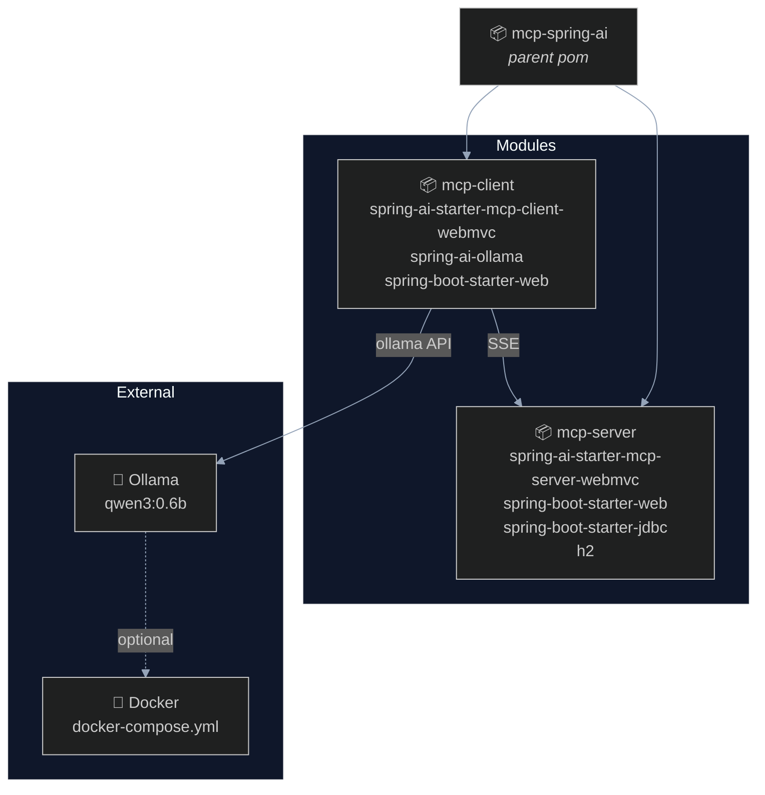

# 📊 MCP Spring AI — Diagrams

> All diagrams are written in [Mermaid](https://mermaid.js.org/) and optimised for **dark appearance** using the `%%{init: ...}%%` directive.

---

## 1. High-Level System Architecture

---

## 2. Tool Call Sequence (SSE Transport)

---

## 3. Streaming Chat Sequence

---

## 4. MCP Server — Component Overview

---

## 5. Transport Modes Comparison

---

## 6. Database Schema (H2 In-Memory)

---

## 7. Maven Module Dependency Graph

