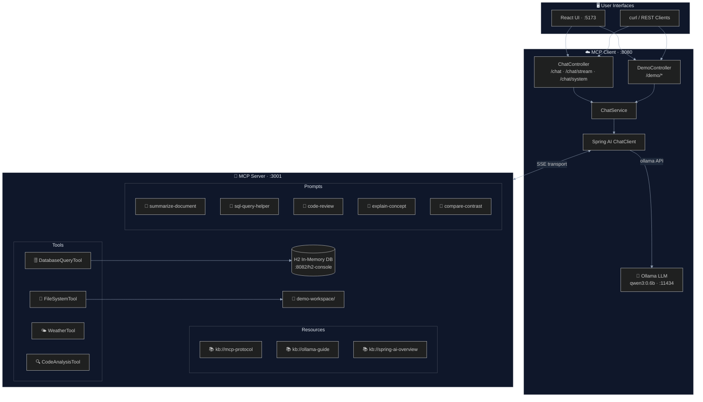

# 🤖 MCP Spring AI Demo

[](https://spring.io/projects/spring-boot)
[](https://spring.io/projects/spring-ai)
[](https://openjdk.org)
[](https://ollama.ai)
[](https://modelcontextprotocol.io)
[](#)

> A comprehensive, hands-on demonstration of the **Model Context Protocol (MCP)** built with **Spring AI** and **Ollama**. The project showcases every major MCP primitive — **Tools**, **Resources**, and **Prompts** — over both **SSE** and **STDIO** transport modes, complete with a React chat front-end.

---

## 📑 Table of Contents

- [Overview](#-overview)
- [Architecture](#-architecture)
- [Project Structure](#-project-structure)
- [Features](#-features)
- [Quick Start](#-quick-start)
- [API Reference](#-api-reference)
- [Demo Scenarios](#-demo-scenarios)
- [Configuration](#-configuration)
- [Documentation](#-documentation)
- [Technology Stack](#-technology-stack)

---

## 🔍 Overview

This project is a multi-module Maven application that demonstrates how to build an **MCP Server** and an **MCP Client** using Spring AI. An LLM running locally through Ollama gains the ability to call real tools, browse structured resources, and apply prompt templates — all mediated by the MCP protocol.

See **[DIAGRAMS.md](DIAGRAMS.md)** for visual architecture and flow diagrams.

---

## 🏗️ Architecture



---

## 📁 Project Structure

```
mcp-spring-ai/
├── mcp-server/                         # Spring AI MCP Server (port 3001)
│   └── src/main/java/…/mcpserver/
│       ├── tools/
│       │   ├── FileSystemTool.java     # Sandboxed workspace file I/O
│       │   ├── DatabaseQueryTool.java  # NL → SQL on H2 database
│       │   ├── WeatherTool.java        # Weather data for 13 cities
│       │   └── CodeAnalysisTool.java   # Java source metrics & patterns
│       ├── resources/
│       │   └── KnowledgeBaseResourceProvider.java  # kb:// URI resources
│       ├── prompts/
│       │   └── DemoPromptProvider.java # 5 reusable prompt templates
│       └── config/McpServerConfig.java
│
├── mcp-client/                         # Spring AI MCP Client (port 8080)
│   └── src/main/java/…/mcpclient/
│       ├── controller/
│       │   ├── ChatController.java     # /chat endpoints
│       │   └── DemoController.java     # /demo pre-built scenarios
│       ├── service/ChatService.java    # ChatClient wrapper
│       └── config/
│           ├── McpClientConfig.java
│           └── CorsConfig.java
│
├── frontend/                           # React + Vite + TypeScript UI (port 5173)
│   └── src/components/
│       ├── ChatView.tsx                # Streaming chat interface
│       ├── DemosView.tsx               # One-click demo runner
│       ├── MessageBubble.tsx
│       └── SystemPromptView.tsx
│
├── demo-workspace/                     # Sandboxed workspace for FileSystemTool
├── docs/                               # Detailed concept guides
├── docker-compose.yml                  # Ollama via Docker
├── Makefile                            # Developer convenience targets
└── pom.xml                             # Multi-module Maven parent
```

---

## ✨ Features

### MCP Tools (4)

| Tool | Description | Key Methods |
|------|-------------|-------------|
| **FileSystemTool** | Sandboxed file operations within `demo-workspace/` | `listFiles`, `readFile`, `writeFile`, `searchFiles` |
| **DatabaseQueryTool** | Read-only SQL against H2 (employees, departments, products, orders) | `executeQuery`, `listTables`, `describeTable` |
| **WeatherTool** | Mock weather data for 13 global cities | `getCurrentWeather`, `getWeatherForecast`, `compareWeather` |
| **CodeAnalysisTool** | Static analysis of Java source files | `analyzeJavaFile`, `findPattern`, `getProjectStructure` |

### MCP Resources (3)

Knowledge base documents exposed as `kb://` URIs and served as read-only MCP resources:

| URI | Document |
|-----|----------|
| `kb://mcp-protocol` | MCP protocol concepts and specification |
| `kb://ollama-guide` | Ollama setup, models, and configuration |
| `kb://spring-ai-overview` | Spring AI features and auto-configuration |

### MCP Prompts (5)

Reusable, parameterized prompt templates:

| Template | Description |
|----------|-------------|
| `summarize-document` | Structured summary with configurable style (`brief`, `detailed`, `bullet-points`) |
| `sql-query-helper` | Guided NL → SQL translation |
| `code-review` | Standardized code review with severity ratings |
| `explain-concept` | Explain technical concepts at configurable depth |
| `compare-and-contrast` | Side-by-side comparison of two subjects |

### Transport Modes

| Mode | When to Use | Config |
|------|-------------|--------|
| **SSE** (default) | Remote client ↔ server over HTTP | `spring.ai.mcp.client.sse.connections` |
| **STDIO** | Embedded / local process | `-Dspring-boot.run.profiles=stdio` |

---

## ⚡ Quick Start

### Prerequisites

- Java 25+
- Docker Desktop (for Ollama via Docker) **or** [Ollama](https://ollama.com) installed locally

### Option A — Makefile (recommended)

```bash
# 1. One-time setup: pull Ollama image + LLM model, build all modules
make setup

# 2. Start MCP Server  (Terminal 1)
make server

# 3. Start MCP Client  (Terminal 2)
make client

# 4. Run all demo smoke-tests
make demo
```

```bash
make help   # list all available targets
```

### Option B — Manual

```bash
# 1. Start Ollama
ollama serve &
ollama pull qwen3:0.6b

# 2. Build
./mvnw package -DskipTests

# 3. Start MCP Server  (Terminal 1)
./mvnw spring-boot:run -pl mcp-server

# 4. Start MCP Client  (Terminal 2)
./mvnw spring-boot:run -pl mcp-client

# 5. (Optional) Start React UI  (Terminal 3)
cd frontend && npm install && npm run dev
```

### Option C — Ollama via Docker only

```bash
docker compose up -d        # starts Ollama container and pulls the model
docker compose down         # stop when done
```

---

## 📡 API Reference

### Chat Endpoints (`/chat`)

| Method | Path | Description |
|--------|------|-------------|
| `POST` | `/chat` | Single-turn chat; returns complete response |
| `POST` | `/chat/stream` | Streaming chat via SSE (token-by-token) |
| `POST` | `/chat/system` | Chat with a custom system prompt override |

**Examples:**

```bash
# Standard chat
curl -X POST http://localhost:8080/chat \
  -H "Content-Type: application/json" \
  -d '{"message": "What is the weather in Tokyo?"}'

# Streaming (token-by-token SSE)
curl -N -X POST http://localhost:8080/chat/stream \
  -H "Content-Type: application/json" \
  -d '{"message": "List all employees in Engineering"}'

# Chat with custom system prompt
curl -X POST http://localhost:8080/chat/system \
  -H "Content-Type: application/json" \
  -d '{"system": "You are a SQL expert.", "message": "Show top 5 earners"}'
```

### Demo Endpoints (`/demo`)

| Method | Path | MCP Feature |
|--------|------|-------------|
| `GET` | `/demo/scenarios` | List all demo scenarios |
| `GET` | `/demo/file-search` | Tools — file system |
| `GET` | `/demo/db-query` | Tools — database query |
| `GET` | `/demo/weather` | Tools — weather |
| `GET` | `/demo/code-review` | Tools — code analysis |
| `GET` | `/demo/knowledge-qa` | Resources — knowledge base |

```bash
curl http://localhost:8080/demo/scenarios   | jq
curl http://localhost:8080/demo/weather     | jq
curl http://localhost:8080/demo/db-query    | jq
curl http://localhost:8080/demo/code-review | jq
curl http://localhost:8080/demo/knowledge-qa | jq
```

---

## 🎬 Demo Scenarios

| # | Demo | MCP Primitive | What Happens |
|---|------|---------------|--------------|
| 1 | 📁 **File Search** | Tool | LLM lists workspace files, reads one, writes a summary |
| 2 | 🗄️ **DB Query** | Tool | LLM translates natural language to SQL and queries H2 |
| 3 | 🌤️ **Weather** | Tool | LLM fetches weather and gives a travel recommendation |
| 4 | 🔍 **Code Review** | Tool | LLM analyses Java source and returns structured feedback |
| 5 | 📚 **Knowledge Q&A** | Resource | LLM answers questions from `kb://` knowledge base documents |

---

## ⚙️ Configuration

### MCP Server (`mcp-server/src/main/resources/application.yaml`)

```yaml
server:
  port: 3001

spring:
  ai:
    mcp:
      server:
        name: mcp-demo-server
        version: 1.0.0
  datasource:
    url: jdbc:h2:mem:demodb;DB_CLOSE_DELAY=-1
  threads:
    virtual:
      enabled: true   # Project Loom virtual threads
```

### MCP Client (`mcp-client/src/main/resources/application.yaml`)

```yaml
server:
  port: 8080

spring:
  ai:
    ollama:
      base-url: http://localhost:11434
      chat:
        model: qwen3:0.6b
        options:
          temperature: 0.2
          num-predict: 2048
    mcp:
      client:
        sse:
          connections:
            mcp-demo-server:
              url: http://localhost:3001
  threads:
    virtual:
      enabled: true
```

### STDIO Transport (alternative)

```bash
./mvnw spring-boot:run -pl mcp-server -Dspring-boot.run.profiles=stdio
```

---

## 📖 Documentation

| Guide | Description |
|-------|-------------|
| [DIAGRAMS.md](DIAGRAMS.md) | Mermaid diagrams — architecture, data flow, sequence |
| [01 — MCP Concepts](docs/01-MCP-CONCEPTS.md) | Protocol roles, capabilities, lifecycle |
| [02 — Architecture](docs/02-ARCHITECTURE.md) | Module structure and Spring AI auto-configuration |
| [03 — Setup Guide](docs/03-SETUP-GUIDE.md) | Step-by-step installation |
| [04 — Transport Modes](docs/04-TRANSPORT-MODES.md) | SSE vs STDIO comparison |
| [05 — Use Cases](docs/05-USE-CASES.md) | Demo walkthroughs and real-world scenarios |

---

## 🛠 Technology Stack

| Layer | Technology |
|-------|-----------|
| Language | Java 25 |
| Framework | Spring Boot 3.5.13 |
| AI Abstraction | Spring AI 1.0.0 |
| LLM Runtime | Ollama (`qwen3:0.6b`) |
| MCP Protocol | Model Context Protocol 1.0 |
| Transport | SSE (default) / STDIO |
| Database | H2 In-Memory |
| Concurrency | Project Loom virtual threads |
| Frontend | React 18, TypeScript, Vite, Tailwind CSS |
| Build | Maven (multi-module) |
| Infrastructure | Docker Compose |

---

## 📝 License

Educational demo project — free to use for learning and experimentation.
