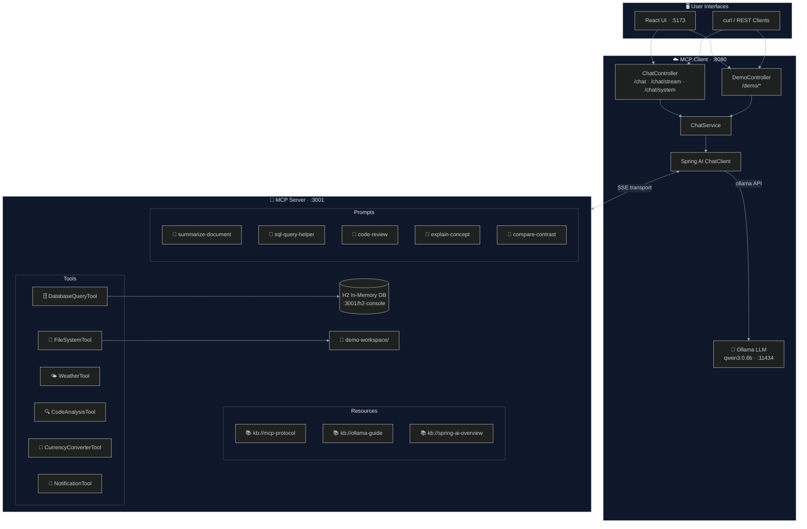
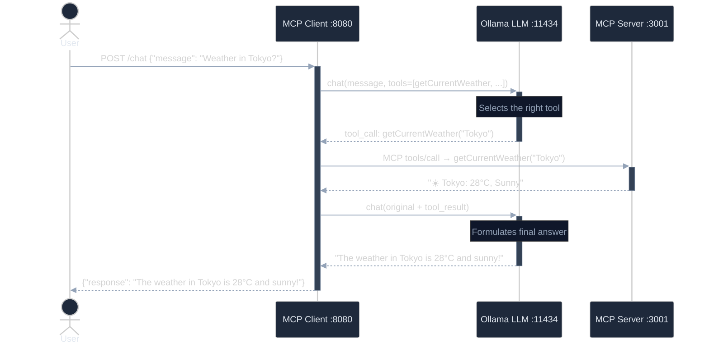

# 🤖 MCP Spring AI Demo

[](https://spring.io/projects/spring-boot)
[](https://spring.io/projects/spring-ai)
[](https://openjdk.org)
[](https://ollama.ai)
[](https://modelcontextprotocol.io)
[](#-testing)
[](#)

> A comprehensive, hands-on demonstration of the **Model Context Protocol (MCP)** built with **Spring AI** and **Ollama**. The project showcases every major MCP primitive — **Tools**, **Resources**, and **Prompts** — over both **SSE** and **STDIO** transport modes, with real-world examples and a React chat front-end.

---

## 📑 Table of Contents

- [Overview](#-overview)
- [Architecture](#-architecture)
- [How a Tool Call Works](#-how-a-tool-call-works)
- [Project Structure](#-project-structure)
- [Features](#-features)
- [Quick Start](#-quick-start)
- [API Reference](#-api-reference)
- [Demo Scenarios](#-demo-scenarios)
- [Frontend](#-frontend)
- [Testing](#-testing)
- [Security](#-security)
- [Extending — Add Your Own Tool](#-extending--add-your-own-tool)
- [Configuration](#-configuration)
- [Documentation](#-documentation)
- [Technology Stack](#-technology-stack)

---

## 🔍 Overview

This project is a multi-module Maven application that demonstrates how to build an **MCP Server** and an **MCP Client** using Spring AI. An LLM running locally through Ollama gains the ability to call real tools, browse structured resources, and apply prompt templates — all mediated by the MCP protocol.

**What makes MCP different from plain function calling?**

| Aspect | Plain Function Calling | MCP |
|--------|----------------------|-----|
| Discovery | Hard-coded in app | Protocol-negotiated at runtime |
| Reusability | Tied to one app | Any MCP client can connect |
| Composition | Manual wiring | Multiple servers compose natively |
| Transport | In-process only | SSE, STDIO, or HTTP Streaming |
| Schema | Ad-hoc | Standardised JSON Schema |

See **[DIAGRAMS.md](DIAGRAMS.md)** for all visual architecture and flow diagrams.

---

## 🏗️ Architecture



---

## 🔄 How a Tool Call Works

Every chat message goes through this multi-step loop, handled transparently by Spring AI:



> The LLM may chain **multiple tool calls** before producing a final response —
> this is how the multi-tool orchestration demo works.

---

## 📁 Project Structure

```
mcp-spring-ai/
├── mcp-server/                              # Spring AI MCP Server (port 3001)
│   └── src/
│       ├── main/java/…/mcpserver/
│       │   ├── tools/
│       │   │   ├── FileSystemTool.java          # Sandboxed workspace file I/O
│       │   │   ├── DatabaseQueryTool.java        # NL → SQL on H2 database
│       │   │   ├── WeatherTool.java              # Weather data for 13 cities
│       │   │   ├── CodeAnalysisTool.java         # Java source metrics & patterns
│       │   │   ├── CurrencyConverterTool.java    # Currency conversion (14 currencies)
│       │   │   └── NotificationTool.java         # Email / Slack / SMS notifications
│       │   ├── resources/
│       │   │   └── KnowledgeBaseResourceProvider.java  # kb:// URI resources
│       │   ├── prompts/
│       │   │   └── DemoPromptProvider.java       # 5 reusable prompt templates
│       │   └── config/McpServerConfig.java
│       └── test/java/…/mcpserver/
│           └── tools/                            # Unit tests for all 6 tools
│
├── mcp-client/                              # Spring AI MCP Client (port 8080)
│   └── src/
│       ├── main/java/…/mcpclient/
│       │   ├── controller/
│       │   │   ├── ChatController.java           # /chat endpoints
│       │   │   └── DemoController.java           # /demo pre-built scenarios
│       │   ├── service/ChatService.java          # ChatClient wrapper
│       │   └── config/
│       │       ├── McpClientConfig.java
│       │       └── CorsConfig.java
│       └── test/java/…/mcpclient/               # WebMvcTest + unit tests
│
├── frontend/                                # React + Vite + TypeScript UI (port 5173)
│   └── src/
│       ├── components/
│       │   ├── ChatView.tsx                      # Streaming chat interface
│       │   ├── DemosView.tsx                     # One-click demo runner
│       │   ├── MessageBubble.tsx
│       │   └── SystemPromptView.tsx
│       ├── constants.ts                          # Demo scenario definitions
│       └── types.ts
│
├── demo-workspace/                          # Sandboxed workspace for FileSystemTool
├── docs/                                    # Detailed concept guides (01–06)
├── DIAGRAMS.md                              # Full Mermaid diagram reference
├── docker-compose.yml                       # Ollama via Docker
├── Makefile                                 # Developer convenience targets
└── pom.xml                                  # Multi-module Maven parent
```

---

## ✨ Features

### MCP Tools (6)

| Tool | Description | Key Methods |
|------|-------------|-------------|
| **FileSystemTool** | Sandboxed file operations within `demo-workspace/` | `listFiles`, `readFile`, `writeFile`, `searchFiles` |
| **DatabaseQueryTool** | Read-only SQL against H2 (employees, departments, products, orders) | `executeQuery`, `listTables`, `tableSummary` |
| **WeatherTool** | Mock weather data for 13 global cities | `getCurrentWeather`, `getWeatherForecast`, `compareWeather` |
| **CodeAnalysisTool** | Static analysis of Java source files | `analyzeJavaFile`, `findPattern`, `scanDirectory` |
| **CurrencyConverterTool** | Currency conversion and multi-currency invoice totals (14 currencies) | `convertCurrency`, `getExchangeRates`, `calculateMultiCurrencyTotal` |
| **NotificationTool** | Multi-channel notifications with delivery tracking | `sendNotification`, `sendBulkNotification`, `getNotificationLog` |

### MCP Resources (3)

Knowledge base documents exposed as `kb://` URIs and served as read-only MCP resources:

| URI | Content |
|-----|---------|
| `kb://mcp-protocol` | MCP protocol concepts and specification |
| `kb://ollama-guide` | Ollama setup, models, and configuration |
| `kb://spring-ai-overview` | Spring AI features and auto-configuration |

### MCP Prompts (5)

Reusable, parameterised prompt templates:

| Template | Parameters | Description |
|----------|-----------|-------------|
| `summarize-document` | `content`, `style` | Structured summary (`brief` / `detailed` / `bullet-points`) |
| `sql-query-helper` | `question`, `tables` | Guided NL → SQL translation |
| `code-review` | `code`, `language`, `focus` | Standardised code review with severity ratings |
| `explain-concept` | `concept`, `level` | Explain at `beginner` / `intermediate` / `advanced` depth |
| `compare-and-contrast` | `item1`, `item2`, `context` | Side-by-side comparison with pros/cons |

### Transport Modes

| Mode | When to Use | How to Enable |
|------|-------------|---------------|
| **SSE** (default) | Remote client ↔ server over HTTP | `spring.ai.mcp.client.sse.connections` in `application.yaml` |
| **STDIO** | Embedded / local process | `make server-stdio` or `-Dspring-boot.run.profiles=stdio` |

---

## ⚡ Quick Start

### Prerequisites

- **Java 25+** (`java -version`)
- **Docker Desktop** (for Ollama) **or** [Ollama](https://ollama.com) installed locally

### Option A — Makefile (recommended)

```bash
# 1. One-time setup: start Ollama, pull model, build all modules
make setup

# 2. Start MCP Server  (Terminal 1)
make server

# 3. Start MCP Client  (Terminal 2)
make client

# 4. (Optional) Start React UI  (Terminal 3)
make frontend

# 5. Run all demo smoke-tests
make demo
```

```bash
make help   # list all available targets
```

### Option B — Manual

```bash
# 1. Start Ollama
ollama serve &
ollama pull qwen3:0.6b

# 2. Build all modules
./mvnw package -DskipTests

# 3. Start MCP Server  (Terminal 1)
./mvnw spring-boot:run -pl mcp-server

# 4. Start MCP Client  (Terminal 2)
./mvnw spring-boot:run -pl mcp-client

# 5. (Optional) Start React UI  (Terminal 3)
cd frontend && npm install && npm run dev
```

### Option C — Ollama via Docker only

```bash
docker compose up -d    # starts Ollama, pulls qwen3:0.6b model
docker compose down     # stop when done
```

---

## 📡 API Reference

### Chat Endpoints (`/chat`)

| Method | Path | Description |
|--------|------|-------------|
| `POST` | `/chat` | Single-turn chat; returns complete response |
| `POST` | `/chat/stream` | Streaming chat via SSE (token-by-token) |
| `POST` | `/chat/system` | Chat with a custom system prompt override |

```bash
# Standard chat — tool calls happen transparently
curl -X POST http://localhost:8080/chat \
  -H "Content-Type: application/json" \
  -d '{"message": "What is the weather in Tokyo?"}'

# Streaming chat (token-by-token SSE)
curl -N -X POST http://localhost:8080/chat/stream \
  -H "Content-Type: application/json" \
  -d '{"message": "List all employees in Engineering"}'

# Chat with a custom system prompt
curl -X POST http://localhost:8080/chat/system \
  -H "Content-Type: application/json" \
  -d '{"system": "You are a SQL expert.", "message": "Show top 5 earners"}'
```

### Demo Endpoints (`/demo`)

| Method | Path | MCP Feature |
|--------|------|-------------|
| `GET` | `/demo/scenarios` | List all available demo scenarios |
| `GET` | `/demo/file-search` | Tools — file system exploration |
| `GET` | `/demo/db-query` | Tools — natural language to SQL |
| `GET` | `/demo/weather` | Tools — weather comparison |
| `GET` | `/demo/code-review` | Tools — code analysis |
| `GET` | `/demo/knowledge-qa` | Resources — knowledge base Q&A |
| `GET` | `/demo/multi-tool` | Orchestration — multi-tool agentic workflow |
| `GET` | `/demo/currency` | Tools — currency conversion and invoices |
| `GET` | `/demo/notification` | Tools — email / Slack / SMS alerts |

```bash
curl http://localhost:8080/demo/scenarios    | jq
curl http://localhost:8080/demo/weather      | jq
curl http://localhost:8080/demo/db-query     | jq
curl http://localhost:8080/demo/code-review  | jq
curl http://localhost:8080/demo/knowledge-qa | jq
curl http://localhost:8080/demo/multi-tool   | jq
curl http://localhost:8080/demo/currency     | jq
curl http://localhost:8080/demo/notification | jq
```

---

## 🎬 Demo Scenarios

| # | Demo | MCP Primitive | What Happens |
|---|------|---------------|--------------|
| 1 | 📁 **File Search** | Tool | LLM lists workspace files, reads one, writes a summary |
| 2 | 🗄️ **DB Query** | Tool | LLM translates natural language to SQL and queries H2 |
| 3 | 🌤️ **Weather** | Tool | LLM fetches weather for 3 cities and recommends one |
| 4 | 🔍 **Code Review** | Tool | LLM analyses Java source and returns structured feedback |
| 5 | 📚 **Knowledge Q&A** | Resource | LLM answers questions from `kb://` knowledge base documents |
| 6 | 🔗 **Multi-Tool Orchestration** | Orchestration | LLM chains DB → Weather → Currency → File → Notification autonomously |
| 7 | 💱 **Currency Converter** | Tool | LLM converts currencies, shows rates, totals multi-currency invoices |
| 8 | 📨 **Notifications** | Tool | LLM sends email/Slack/SMS alerts and checks the delivery log |

---

## 🖥️ Frontend

The React UI (port `5173`) provides two views:

### Chat View
- Full-duplex streaming chat powered by `POST /chat/stream` (SSE)
- Markdown rendering of all responses (code blocks, tables, lists)
- System prompt editor to customise AI behaviour per session
- Token-by-token streaming with live cursor indicator

### Demos View
- One-click runner for all 8 pre-built demo scenarios
- Each card shows the MCP primitive badge, endpoint, and description
- Results rendered as collapsible markdown panels with elapsed time
- Runs against `GET /demo/{scenario}` — no configuration required

```bash
# Start the frontend dev server
make frontend
# or
cd frontend && npm install && npm run dev
# open http://localhost:5173
```

The Vite dev server proxies `/chat` and `/demo` to `localhost:8080` — no CORS
configuration is needed during development.

---

## 🧪 Testing

The project has **168 tests** across both modules with zero failures.

```bash
make test
# or
./mvnw test
```

### Test breakdown

| Module | Test Class | Type | Tests |
|--------|-----------|------|-------|
| `mcp-server` | `FileSystemToolTest` | Unit | 21 |
| `mcp-server` | `WeatherToolTest` | Unit | 17 |
| `mcp-server` | `CurrencyConverterToolTest` | Unit | 24 |
| `mcp-server` | `NotificationToolTest` | Unit | 22 |
| `mcp-server` | `CodeAnalysisToolTest` | Unit | 12 |
| `mcp-server` | `DatabaseQueryToolTest` | `@JdbcTest` slice | 13 |
| `mcp-server` | `KnowledgeBaseResourceProviderTest` | Unit | 7 |
| `mcp-server` | `DemoPromptProviderTest` | Unit | 18 |
| `mcp-server` | `McpServerApplicationTests` | Integration | 1 |
| `mcp-client` | `ChatControllerTest` | `@WebMvcTest` slice | 9 |
| `mcp-client` | `DemoControllerTest` | `@WebMvcTest` slice | 17 |
| `mcp-client` | `ChatServiceTest` | Unit (Mockito) | 6 |
| `mcp-client` | `McpClientApplicationTests` | Integration | 1 |

### Test strategy

- **Tool unit tests** — pure Java, no Spring context, fast execution
- **`@JdbcTest` slice** — `DatabaseQueryTool` uses a real H2 instance loaded with `schema.sql` + `data.sql`
- **`@WebMvcTest` slice** — controller tests use `MockMvc` with `@MockitoBean` for `ChatService`
- **Mockito fluent mocking** — `ChatServiceTest` mocks the entire `ChatClient` builder chain

---

## 🔒 Security

Each tool applies a different real-world security pattern:

| Tool | Pattern | Details |
|------|---------|---------|
| **FileSystemTool** | Path sandbox | All paths resolved against `demo-workspace/`; `../` traversal is rejected |
| **FileSystemTool** | Size limit | Reads capped at 100 KB per file |
| **DatabaseQueryTool** | Allow-list | Only `SELECT` statements are executed |
| **DatabaseQueryTool** | Block-list | `DROP`, `DELETE`, `INSERT`, `UPDATE`, `ALTER`, `TRUNCATE` blocked by keyword scan |
| **DatabaseQueryTool** | Table name validation | `tableSummary()` accepts only `[a-zA-Z_][a-zA-Z0-9_]*` to prevent injection |
| **NotificationTool** | Input validation | Email format, Slack `#`/`@` prefix, phone digit count — validated before any side effect |
| **CodeAnalysisTool** | Read-only | Scans files but never modifies them |

> For production, add Spring Security authentication, rate limiting per tool,
> and a persistent audit log to the MCP server.

---

## 🔧 Extending — Add Your Own Tool

Adding a new MCP tool takes three steps:

**1. Create the tool class** in `mcp-server/src/main/java/com/example/mcpserver/tools/`:

```java
@Component
public class MyTool {

    @Tool(description = "Clear description of what this tool does and when to use it. " +
            "Include parameter meaning and return value format.")
    public String myMethod(
            @ToolParam(description = "Description of this parameter") String param) {
        // Always validate inputs
        if (param == null || param.isBlank()) return "Error: param is required";
        // Return a human-readable String — never throw exceptions
        return "Result: " + param.toUpperCase();
    }
}
```

**2. Register it** in `McpServerConfig.java`:

```java
@Bean
public ToolCallbackProvider myToolProvider(MyTool myTool) {
    return MethodToolCallbackProvider.builder()
            .toolObjects(myTool)
            .build();
}
```

**3. Restart the server** — the client discovers tools at connection time; no client changes are needed.

### Tool design best practices

| Practice | Why |
|----------|-----|
| Return `String`, not exceptions | The LLM must receive a readable error message to recover gracefully |
| Include constraints in `@Tool` description | The LLM reads this to decide when and how to call the tool |
| Validate all inputs before side effects | Prevents accidental damage from LLM hallucinations |
| Provide batch operations for common chains | Reduces round-trips when the same sequence of calls always appears together |
| Use thread-safe collections for shared state | Tool instances are Spring singletons; concurrent requests share the same object |

---

## ⚙️ Configuration

### MCP Server (`mcp-server/src/main/resources/application.yaml`)

```yaml
server:
  port: 3001

spring:
  ai:
    mcp:
      server:
        name: mcp-demo-server
        version: 1.0.0
  datasource:
    url: jdbc:h2:mem:demodb;DB_CLOSE_DELAY=-1
  h2:
    console:
      enabled: true   # http://localhost:3001/h2-console (JDBC URL: jdbc:h2:mem:demodb)
  threads:
    virtual:
      enabled: true   # Project Loom virtual threads
```

### MCP Client (`mcp-client/src/main/resources/application.yaml`)

```yaml
server:
  port: 8080

spring:
  ai:
    ollama:
      base-url: http://localhost:11434
      chat:
        model: qwen3:0.6b
        options:
          temperature: 0.2
          num-predict: 2048
    mcp:
      client:
        sse:
          connections:
            mcp-demo-server:
              url: http://localhost:3001
  threads:
    virtual:
      enabled: true
```

### STDIO transport (alternative)

```bash
make server-stdio
# or
./mvnw spring-boot:run -pl mcp-server -Dspring-boot.run.profiles=stdio
```

---

## 📖 Documentation

| Guide | Description |
|-------|-------------|
| [DIAGRAMS.md](DIAGRAMS.md) | Mermaid diagrams — architecture, sequences, schema, module graph |
| [01 — MCP Concepts](docs/01-MCP-CONCEPTS.md) | Protocol roles, capabilities, lifecycle |
| [02 — Architecture](docs/02-ARCHITECTURE.md) | Module structure and Spring AI auto-configuration |
| [03 — Setup Guide](docs/03-SETUP-GUIDE.md) | Step-by-step installation |
| [04 — Transport Modes](docs/04-TRANSPORT-MODES.md) | SSE vs STDIO — when to use each |
| [05 — Use Cases](docs/05-USE-CASES.md) | Demo walkthroughs and real-world scenario descriptions |
| [06 — Real-World Examples](docs/06-REAL-WORLD-EXAMPLES.md) | Production patterns: Currency, Notifications, Orchestration |

---

## 🛠 Technology Stack

| Layer | Technology | Version |
|-------|-----------|---------|
| Language | Java | 25 |
| Framework | Spring Boot | 3.5.13 |
| AI Abstraction | Spring AI | 1.0.0 |
| MCP Protocol | Model Context Protocol | 1.0 |
| LLM Runtime | Ollama (`qwen3:0.6b`) | latest |
| Transport | SSE (default) / STDIO | — |
| Database | H2 In-Memory | — |
| Concurrency | Project Loom virtual threads | — |
| Frontend | React 18, TypeScript, Vite, Tailwind CSS | — |
| Build | Maven (multi-module) | — |
| Infrastructure | Docker Compose | — |

---

## 📝 License

Educational demo project — free to use for learning and experimentation.
