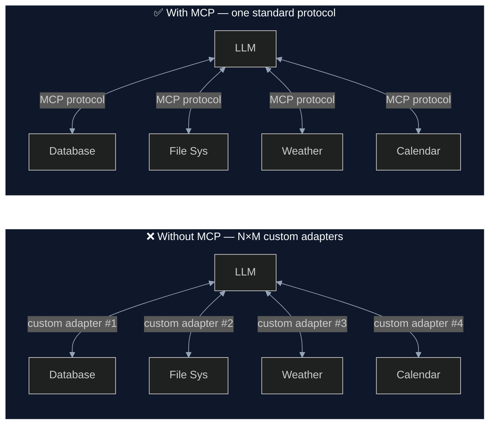
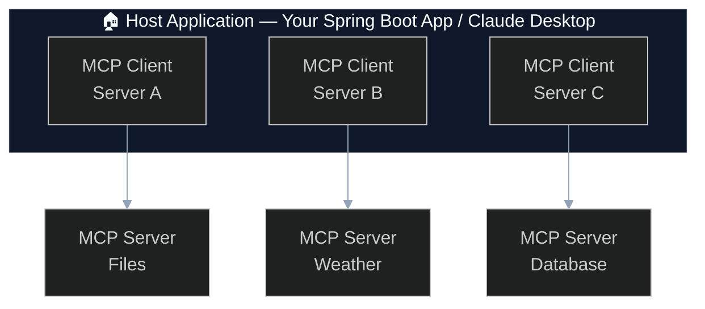
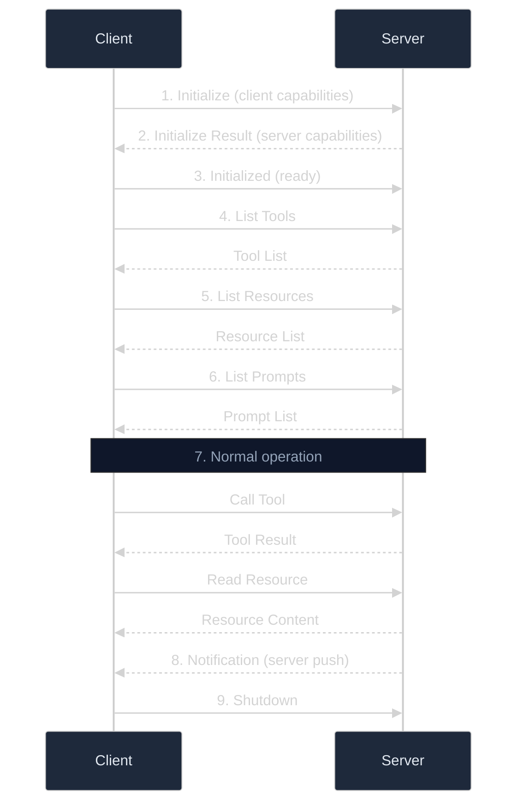

# 01 — MCP Concepts: Understanding the Model Context Protocol

## Table of Contents
- [What is MCP?](#what-is-mcp)
- [Why Was MCP Created?](#why-was-mcp-created)
- [The MCP Architecture](#the-mcp-architecture)
- [Core Capabilities](#core-capabilities)
- [Protocol Lifecycle](#protocol-lifecycle)
- [MCP vs Traditional Approaches](#mcp-vs-traditional-approaches)

---

## What is MCP?

The **Model Context Protocol (MCP)** is an open standard created by Anthropic that defines
a universal way for AI applications to communicate with external data sources and tools.

Think of MCP as **"USB-C for AI"** — just as USB-C provides a single connector that works
with any device, MCP provides a single protocol that lets any AI model work with any tool
provider.

### The Problem MCP Solves

Before MCP, integrating an LLM with external tools required:



Every integration was custom:
- Each tool needed its own API adapter
- No standard for capability discovery
- Inconsistent error handling
- Impossible to compose tools from different vendors
- Duplicated effort across every AI application

## Why Was MCP Created?

MCP was created to address the **N×M integration problem**:

- **N** AI applications (Claude, ChatGPT, custom apps...)
- **M** tool providers (databases, APIs, file systems...)
- Without a standard: **N × M** custom integrations needed
- With MCP: **N + M** implementations (each side implements MCP once)

### Key Design Goals

1. **Universality**: Works with any LLM and any tool provider
2. **Simplicity**: Easy to implement on both client and server side
3. **Security**: Clear permission boundaries and capability negotiation
4. **Composability**: Multiple servers can be connected simultaneously
5. **Discoverability**: Clients can discover what a server offers at runtime

---

## The MCP Architecture

MCP defines three roles:



### Host
The **host** is your application — it's where the LLM runs and where users interact.
In this project, the `mcp-client` module is the host.

**Responsibilities:**
- Manages MCP client lifecycle
- Provides the LLM (Ollama) for processing
- Presents results to the user (REST API)

### Client
The **client** maintains a 1:1 connection with a single MCP server.
A host can have multiple clients, each connected to a different server.

**Responsibilities:**
- Connects to an MCP server
- Discovers server capabilities (tools, resources, prompts)
- Forwards tool calls from the LLM to the server
- Returns results back to the LLM

### Server
The **server** exposes capabilities for clients to consume.
In this project, the `mcp-server` module is the server.

**Responsibilities:**
- Declares available tools, resources, and prompts
- Executes tool invocations
- Serves resource content
- Generates prompt messages

---

## Core Capabilities

### 1. 🔧 Tools

Tools are **executable functions** that the LLM can call. They represent actions
the AI can take in the real world.

```
User: "What's the weather in Tokyo?"
  → LLM sees tool: getCurrentWeather(city: String)
  → LLM calls: getCurrentWeather("Tokyo")
  → Server executes the function
  → Server returns: "Tokyo: 28°C, Sunny"
  → LLM formats response: "The weather in Tokyo is 28°C and sunny!"
```

**Key characteristics:**
- LLM **decides when** to call a tool (based on user intent)
- Tools have **descriptions** that help the LLM understand when to use them
- Tools have **typed parameters** defined via JSON Schema
- Tool execution happens on the **server side**

**In this project:** `FileSystemTool`, `DatabaseQueryTool`, `WeatherTool`, `CodeAnalysisTool`

### 2. 📚 Resources

Resources provide **read-only data access**. Unlike tools (which perform actions),
resources simply make information available.

```
Client: "What resources are available?"
  → Server: [kb://spring-ai, kb://mcp-protocol, kb://ollama-guide]

Client: "Read kb://mcp-protocol"
  → Server returns the markdown content of the MCP protocol document
```

**Key characteristics:**
- URI-based addressing (custom schemes allowed: `kb://`, `file://`, `db://`)
- MIME type declarations for content format
- Support for both text and binary content
- Optional **resource templates** for parameterized URIs

**In this project:** `KnowledgeBaseResourceProvider` exposes markdown docs via `kb://` URIs

### 3. 💬 Prompts

Prompts are **reusable, parameterized templates** that guide LLM interactions.
They're not ad-hoc user messages — they're structured recipes for specific tasks.

```
Client: "What prompts are available?"
  → Server: [summarize-document, sql-query-helper, code-review, ...]

Client: "Use code-review with code=<...> and focus=security"
  → Server generates a structured prompt message sequence
  → Client sends it to the LLM
```

**Key characteristics:**
- Named and discoverable
- Required and optional arguments
- Can generate multi-message sequences (system + user)
- Dynamic content based on arguments

**In this project:** `DemoPromptProvider` with 5 prompt templates

### 4. 🌱 Roots (Experimental)

Roots define **file system boundaries** that clients share with servers.
They tell the server which directories it's allowed to access.

**Example:** A client might declare roots as `["/home/user/projects"]`,
telling the server it can only access files under that path.

### 5. 🔄 Sampling (Experimental)

Sampling allows **servers to request LLM completions through the client**.
This enables sophisticated server-side workflows that need AI reasoning.

**Example:** A code analysis server could request the client's LLM to
generate a human-readable summary of its findings.

---

## Protocol Lifecycle



---

## MCP vs Traditional Approaches

| Aspect | Traditional (REST APIs) | MCP |
|--------|------------------------|-----|
| Discovery | Manual (read docs) | Automatic (protocol negotiation) |
| Schema | Varies per API | Standardized JSON Schema |
| AI Integration | Custom per tool | Universal — LLM selects tools |
| Composition | Complex wiring | Connect multiple servers easily |
| Security | Varies | Built-in capability negotiation |
| Transport | HTTP only | STDIO, SSE, HTTP Streaming |
| State | Stateless (usually) | Persistent session with notifications |

---

## Next Steps

- **[02-ARCHITECTURE.md](02-ARCHITECTURE.md)** — How this project implements MCP
- **[03-SETUP-GUIDE.md](03-SETUP-GUIDE.md)** — Get the demo running

