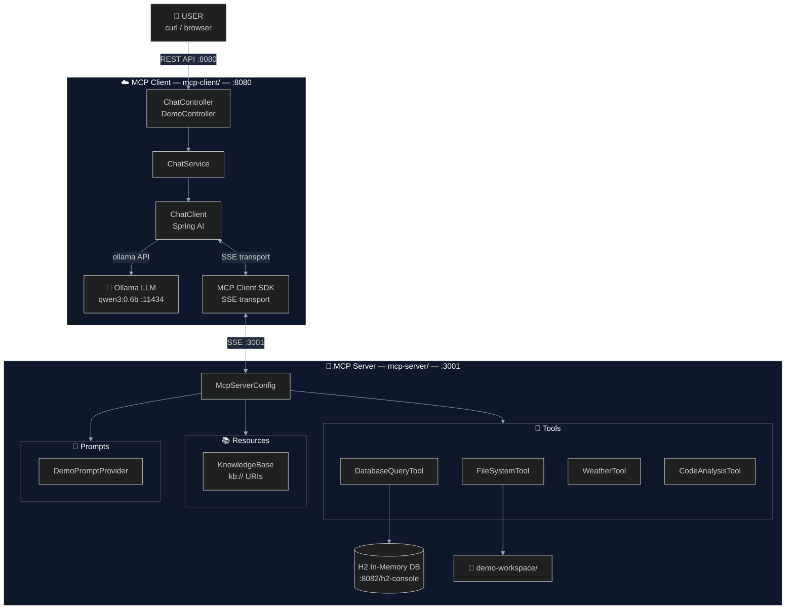

# 02 — Architecture: How This Project Is Built

## Table of Contents
- [High-Level Architecture](#high-level-architecture)
- [Module Overview](#module-overview)
- [Data Flow](#data-flow)
- [Spring AI Auto-Configuration](#spring-ai-auto-configuration)
- [Key Design Decisions](#key-design-decisions)
- [Component Deep Dive](#component-deep-dive)

---

## High-Level Architecture



---

## Module Overview

### `mcp-server` — The MCP Server

**Purpose:** Expose tools, resources, and prompts via the MCP protocol.

**Dependencies:**
| Dependency | Purpose |
|-----------|---------|
| `spring-ai-starter-mcp-server-webmvc` | MCP server with SSE transport |
| `spring-boot-starter-web` | HTTP server for SSE endpoints |
| `spring-boot-starter-jdbc` + `h2` | Database for SQL demo |

**Key beans registered:**
```
ToolCallbackProvider ─── wraps @Tool methods → MCP tools
List<SyncResourceSpecification> ─── knowledge base → MCP resources
List<SyncPromptSpecification> ─── prompt templates → MCP prompts
```

### `mcp-client` — The MCP Client + LLM Host

**Purpose:** Connect to MCP server, use Ollama LLM, expose REST API.

**Dependencies:**
| Dependency | Purpose |
|-----------|---------|
| `spring-ai-starter-mcp-client` | MCP client auto-configuration |
| `spring-ai-starter-model-ollama` | Ollama chat model |
| `spring-boot-starter-web` | REST API |

**Key beans registered:**
```
ChatClient ─── combines Ollama LLM + MCP tools
ChatService ─── business logic for AI interactions
ChatController ─── REST endpoints
DemoController ─── pre-built demo scenarios
```

---

## Data Flow

### What happens when you call `POST /chat {"message": "What's the weather in Tokyo?"}`

```
1. REST Request → ChatController
   ↓
2. ChatController → ChatService.chat("What's the weather in Tokyo?")
   ↓
3. ChatService → ChatClient.prompt().user(message).call()
   ↓
4. ChatClient sends message to Ollama (qwen3:0.6b)
   including descriptions of all available MCP tools
   ↓
5. Ollama analyzes the message and decides to call a tool:
   → Tool: "getCurrentWeather"
   → Arguments: {"city": "Tokyo"}
   ↓
6. Spring AI intercepts the tool call request
   → Serializes it into MCP protocol format
   → Sends it to the MCP server via SSE transport
   ↓
7. MCP Server receives the tool call
   → Routes to WeatherTool.getCurrentWeather("Tokyo")
   → Executes the Java method
   → Returns the result as a string
   ↓
8. Spring AI receives the tool result via MCP
   → Feeds it back to Ollama as a "tool response"
   ↓
9. Ollama generates the final human-readable response:
   "The current weather in Tokyo is 28°C and sunny! ☀️"
   ↓
10. Response flows back through:
    ChatClient → ChatService → ChatController → REST Response
```

### Multi-tool Scenario

The LLM can call **multiple tools in sequence**:

```
User: "Compare the weather in Tokyo and Paris, then write a report"

Step 1: LLM calls getCurrentWeather("Tokyo")      → gets Tokyo weather
Step 2: LLM calls getCurrentWeather("Paris")       → gets Paris weather
Step 3: LLM calls compareWeather("Tokyo", "Paris") → gets comparison
Step 4: LLM calls writeFile("report.txt", "...")   → writes the report
Step 5: LLM generates final response summarizing what it did
```

---

## Spring AI Auto-Configuration

Spring AI uses Spring Boot's auto-configuration to wire everything together.
Here's what each starter configures automatically:

### `spring-ai-starter-mcp-server-webmvc`

Auto-configures:
- `McpSyncServer` — the core MCP server instance
- SSE transport endpoints at `/sse` (for connections) and `/mcp/message` (for messages)
- Tool registration from any `ToolCallbackProvider` beans
- Resource registration from any `List<SyncResourceSpecification>` beans
- Prompt registration from any `List<SyncPromptSpecification>` beans

### `spring-ai-starter-mcp-client`

Auto-configures:
- `McpSyncClient` beans — one per configured server connection
- `ToolCallbackProvider` beans for each MCP server's tools
- Transport setup (SSE or STDIO) based on configuration

### `spring-ai-starter-model-ollama`

Auto-configures:
- `OllamaChatModel` — the LLM client
- `ChatClient.Builder` — pre-configured with Ollama
- Connection to Ollama API at configured base URL

---

## Key Design Decisions

### Why Multi-Module?

| Approach | Pros | Cons |
|----------|------|------|
| **Multi-module** ✅ | Clear separation of concerns, realistic architecture, independent deployment | More complex build |
| Single module | Simpler build | Mixed dependencies, unclear boundaries |

We chose multi-module because MCP is fundamentally about **server-client separation**.
Having separate modules makes the architecture tangible and mirrors real-world deployments.

### Why SSE as Default Transport?

| Transport | Best For | Why Default? |
|-----------|----------|-------------|
| **SSE** ✅ | Development, debugging, remote servers | Easy to test with curl, visible HTTP traffic |
| STDIO | Production subprocess, CLI tools | Harder to debug, same-machine only |

SSE is the default because it's **easier to develop and debug** — you can see the
HTTP traffic, test with curl, and run server/client independently.

### Why Ollama with qwen3:0.6b?

| Model | Size | Tool Calling | Speed |
|-------|------|-------------|-------|
| **qwen3:0.6b** ✅ | ~400MB | Good | Very fast |
| qwen3:1.7b | ~1GB | Better | Fast |
| llama3.2:3b | ~2GB | Good | Moderate |
| mistral:7b | ~4GB | Excellent | Slower |

We default to `qwen3:0.6b` because it:
- Supports tool calling (essential for MCP demos)
- Is small enough to run on any developer machine
- Responds quickly, making demos interactive
- Can be upgraded to larger models by changing one config line

### Why H2 In-Memory Database?

- **Zero setup** — no external database to install
- **Pre-loaded data** — schema and data created on startup
- **Browsable** — H2 Console available at `/h2-console`
- **Safe** — in-memory, resets on restart, no persistence concerns

### Why Sandboxed File System?

All file operations are restricted to `demo-workspace/`:
- **Security** — prevents accidental access to system files
- **Safety** — path traversal attacks are blocked
- **Reproducibility** — demo data is included in the repo
- **Cleanup** — easy to reset by deleting the directory

---

## Component Deep Dive

### Tool Registration Flow

```java
// 1. Define a tool with @Tool annotation
@Component
public class WeatherTool {
    @Tool(description = "Get weather for a city")
    public String getCurrentWeather(@ToolParam(description = "City name") String city) {
        return "Tokyo: 28°C, Sunny";
    }
}

// 2. Register via ToolCallbackProvider
@Bean
public ToolCallbackProvider toolCallbackProvider(WeatherTool weatherTool) {
    return MethodToolCallbackProvider.builder()
        .toolObjects(weatherTool)
        .build();
}

// 3. Spring AI auto-configuration:
//    ToolCallbackProvider → MCP Tool Definition → JSON Schema
//    {
//      "name": "getCurrentWeather",
//      "description": "Get weather for a city",
//      "inputSchema": {
//        "type": "object",
//        "properties": {
//          "city": {"type": "string", "description": "City name"}
//        },
//        "required": ["city"]
//      }
//    }
```

### Resource Registration Flow

```java
// Resources are registered as a list of SyncResourceSpecification beans
@Bean
public List<McpServerFeatures.SyncResourceSpecification> resourceSpecifications() {
    var resource = new McpSchema.Resource(
        "kb://spring-ai",           // URI
        "Spring AI Overview",        // Name
        "Overview of Spring AI",     // Description
        "text/markdown",             // MIME type
        null                         // Annotations
    );

    var specification = new McpServerFeatures.SyncResourceSpecification(
        resource,
        (exchange, request) -> {
            String content = readFile("knowledge-base/spring-ai-overview.md");
            return new McpSchema.ReadResourceResult(List.of(
                new McpSchema.TextResourceContents(
                    request.uri(), "text/markdown", content
                )
            ));
        }
    );

    return List.of(specification);
}
```

### Prompt Registration Flow

```java
// Prompts are registered similarly, with argument definitions and handlers
@Bean
public List<McpServerFeatures.SyncPromptSpecification> promptSpecifications() {
    var prompt = new McpSchema.Prompt(
        "summarize-document",
        "Summarize a document",
        List.of(new McpSchema.PromptArgument("content", "Text to summarize", true))
    );

    var specification = new McpServerFeatures.SyncPromptSpecification(
        prompt,
        (exchange, request) -> {
            Object content = request.arguments().get("content");
            return new McpSchema.GetPromptResult(
                "Document summary",
                List.of(new McpSchema.PromptMessage(
                    McpSchema.Role.USER,
                    new McpSchema.TextContent("Summarize: " + content)
                ))
            );
        }
    );

    return List.of(specification);
}
```

---

## Next Steps

- **[03-SETUP-GUIDE.md](03-SETUP-GUIDE.md)** — Install everything and get running
- **[04-TRANSPORT-MODES.md](04-TRANSPORT-MODES.md)** — SSE vs STDIO deep dive


