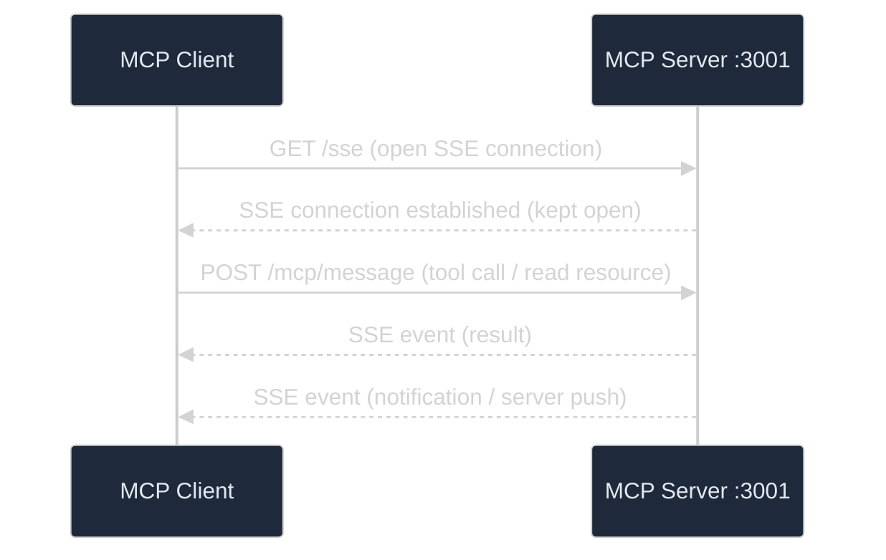
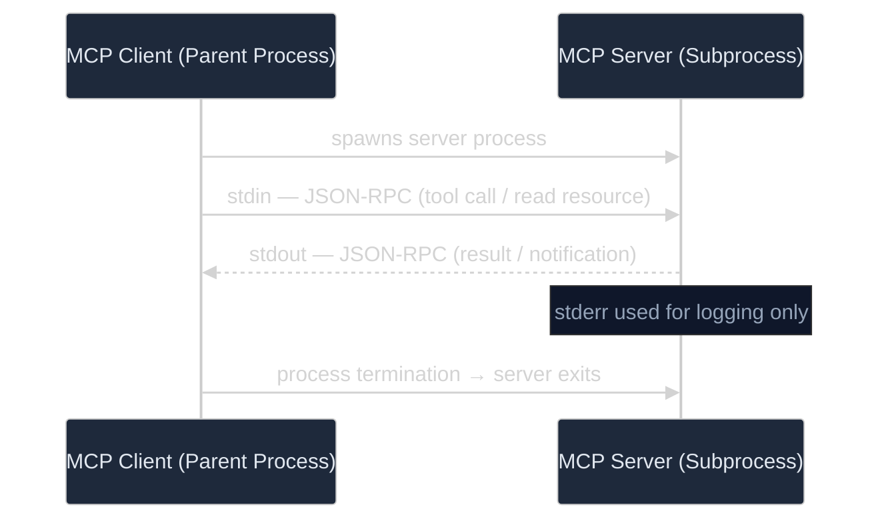

# 04 — Transport Modes: SSE vs STDIO

## Table of Contents
- [Overview](#overview)
- [SSE Transport](#sse-transport-server-sent-events)
- [STDIO Transport](#stdio-transport-standard-io)
- [Comparison Table](#comparison-table)
- [When to Use Each](#when-to-use-each)
- [Configuration in This Project](#configuration-in-this-project)
- [Advanced: Streamable HTTP](#advanced-streamable-http)

---

## Overview

MCP supports multiple **transport modes** — the mechanism by which the client and
server exchange messages. The protocol messages are the same regardless of transport;
only the delivery mechanism changes.

Think of it like email vs. instant messaging: the content is the same, but the
delivery mechanism has different trade-offs.


---

## SSE Transport (Server-Sent Events)

### How It Works



**SSE uses two channels:**
1. **SSE connection** (`GET /sse`) — Server → Client (results, notifications)
2. **HTTP POST** (`POST /mcp/message`) — Client → Server (tool calls, requests)

### Characteristics

| Aspect | Detail |
|--------|--------|
| Network | HTTP-based, works over network |
| Server | Runs as a standalone web application |
| Client | Connects via URL |
| Lifecycle | Server runs independently, client connects/disconnects |
| Debugging | Easy — use browser dev tools, curl, Postman |
| Scalability | Can serve multiple clients |
| Firewall | Requires open port |

### Configuration

**Server** (`mcp-server/src/main/resources/application.yaml`):
```yaml
# SSE is the default mode — no extra configuration needed
server:
  port: 3001  # The server's HTTP port

spring.ai.mcp.server:
  name: mcp-demo-server
  version: 1.0.0
```

**Client** (`mcp-client/src/main/resources/application.yaml`):
```yaml
spring.ai.mcp.client:
  sse:
    connections:
      mcp-demo-server:                    # Connection name (arbitrary)
        url: http://localhost:3001        # Server base URL
```

### Running in SSE Mode

```bash
# Terminal 1: Start server
./mvnw spring-boot:run -pl mcp-server

# Terminal 2: Start client
./mvnw spring-boot:run -pl mcp-client
```

---

## STDIO Transport (Standard I/O)

### How It Works



**STDIO uses standard streams:**
1. **stdin** — Client → Server (sends requests)
2. **stdout** — Server → Client (sends responses)
3. **stderr** — Server → Client (logging, not MCP messages)

### Characteristics

| Aspect | Detail |
|--------|--------|
| Network | No network — process-local |
| Server | Runs as a subprocess of the client |
| Client | Launches and manages server process |
| Lifecycle | Server starts/stops with client |
| Debugging | Harder — no HTTP traffic to inspect |
| Scalability | 1:1 relationship (one server per client) |
| Firewall | No firewall issues |
| Security | Process isolation only |

### Configuration

**Server** (`mcp-server/src/main/resources/application-stdio.yaml`):
```yaml
spring:
  ai:
    mcp:
      server:
        transport: STDIO    # Use STDIO instead of SSE
  main:
    web-application-type: none  # Disable web server
```

**Client** (STDIO mode — would need additional profile):
```yaml
spring.ai.mcp.client:
  stdio:
    connections:
      mcp-demo-server:
        command: java
        args:
          - -jar
          - mcp-server/target/mcp-server-0.0.1-SNAPSHOT.jar
          - --spring.profiles.active=stdio
```

### Running in STDIO Mode

```bash
# First, build the server JAR
./mvnw package -pl mcp-server -DskipTests

# Start client with STDIO (client launches server automatically)
./mvnw spring-boot:run -pl mcp-client -Dspring-boot.run.profiles=stdio
```

---

## Comparison Table

| Feature | SSE | STDIO |
|---------|-----|-------|
| **Setup complexity** | Two separate processes | Single process |
| **Network required** | Yes | No |
| **Remote access** | ✅ Yes | ❌ Same machine only |
| **Debugging** | ✅ Easy (HTTP tools) | ⚠️ Harder |
| **Multiple clients** | ✅ Yes | ❌ 1:1 only |
| **Process management** | Manual (start/stop separately) | Automatic (client manages server) |
| **Latency** | Network latency | Minimal (IPC) |
| **Security** | Network security needed | Process isolation |
| **Production use** | ✅ Recommended | ⚠️ For local tools |
| **Development use** | ✅ Recommended | Good for CLI tools |

---

## When to Use Each

### Use SSE When:

1. **Development and debugging** — You can inspect HTTP traffic, test with curl,
   and run server/client independently.

2. **Shared MCP servers** — Multiple clients can connect to the same server.
   Example: A company-wide database query server.

3. **Remote servers** — The server runs on a different machine.
   Example: A cloud-hosted API integration server.

4. **Microservices architecture** — The MCP server is a standalone service
   in your infrastructure.

5. **This demo project** — SSE is the default because it's most practical
   for learning and experimentation.

### Use STDIO When:

1. **CLI tools** — The MCP server is a command-line tool that processes
   local data.

2. **IDE integrations** — The host (IDE) launches MCP servers as subprocesses.
   Example: Claude Desktop, VS Code extensions.

3. **Sandboxed environments** — When you want process-level isolation
   without network exposure.

4. **Single-user tools** — Personal productivity tools that don't need
   to be shared.

5. **Embedded servers** — When the server is tightly coupled to the client
   and shouldn't run independently.

---

## Configuration in This Project

This project is configured for **SSE by default** with optional STDIO support:

### Default (SSE)

```bash
# Terminal 1
./mvnw spring-boot:run -pl mcp-server
# → Server on port 3001 with SSE endpoint at /sse

# Terminal 2
./mvnw spring-boot:run -pl mcp-client
# → Client connects to http://localhost:3001
```

### STDIO Mode

```bash
# Build server JAR first
./mvnw package -pl mcp-server -DskipTests

# Run server in STDIO mode directly (for testing)
java -jar mcp-server/target/mcp-server-0.0.1-SNAPSHOT.jar --spring.profiles.active=stdio
```

---

## Advanced: Streamable HTTP

MCP also defines a newer **Streamable HTTP** transport that combines the benefits
of both SSE and traditional HTTP:

- Request-response for simple operations
- Streaming for long-running operations
- Better connection management than SSE
- Compatible with standard HTTP infrastructure

Spring AI may add support for Streamable HTTP in future releases.
Check the [Spring AI documentation](https://docs.spring.io/spring-ai/reference/) for updates.

---

## Next Steps

- **[05-USE-CASES.md](05-USE-CASES.md)** — See each demo scenario in detail

